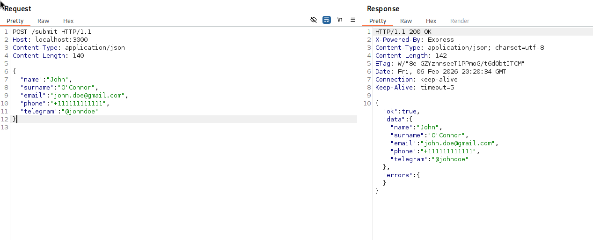
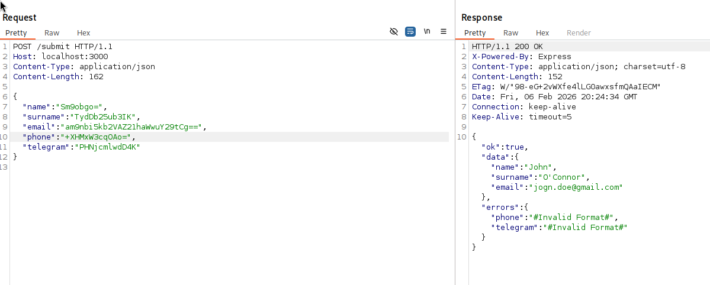
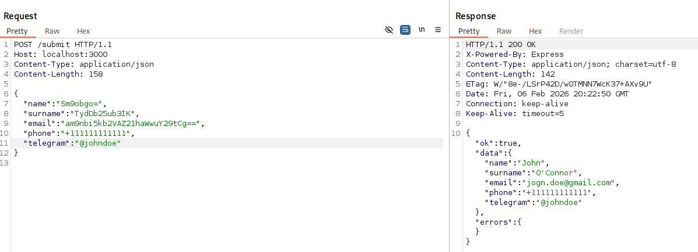

# Input Validator Backend

A TypeScript backend module for sanitizing and validating user inputs. Protects against XSS, unsafe payloads, and invalid formats for emails, names, surnames, Telegram handles, and phone numbers.

## Features

Validates and sanitizes

- name / surname

- email

- phone

- telegram

Prevents stored XSS using decoding, Unicode normalization, and sanitization.

Limits input length to 1024 characters.

Returns structured results with sanitized data and validation errors.

## Installation

For internal usage, simply copy the module into your project:

`Clone or copy your validator module`

>Test `npx tsx src/server.ts`

## Known Limitations

Fields that trigger validation errors may be skipped rather than rejected. For example:

Input:
```json
{
  "name": "John",
  "email": "<script>",
  "surname": "O'niel"
}
```
Output:
```json
{
  "name": "John",
  "surname": "O'neil"
}
```

## PoC


 





## Security Considerations

Protects against common XSS vectors and unsafe payloads.

Always validate sensitive data server-side in addition to sanitization.

Never trust client-side validation alone.

